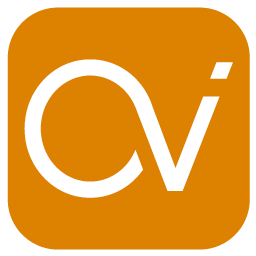

# CUVI

## Objetivos 

El objetivo de este proyecto es el de recrear una aplicación de creación y customización de un curriculum vitae por parte de los usuarios, y por parte de los recruiters tener una cartera de posibles candidatos para enviar las ofertas laborales que vayan creando.

## Tecnologías usadas

|transversales|Diseño|Server-Side|Client-Side|Testing|
|-|-|-|-|-|
|Metodología Agile|sketch|Firebase|React JS|JEST|
|SCRUM|Adobe Illustrator|Firestore|React Native||
|ES5/ES6|||||
|Trello|||||
|Git & Github|||||
|Todoist|||||

## Descripción funcional 

* Para los usuarios regulares: Una vez autenticados, pasan a un dashboard donde se puede customizar la información que aparecerá en sus CV y su tarjeta de usuario, en siguientes iteraciones se podrá escoger diferentes frontales para customizar esta información. Si se va a la pestaña de usuario, se puede visualizar la tarjeta de usuario, asi como customizar la imagen y el color de esta, junto con la opción de logout.
* Para los usuarios recruiters: Una vez autenticados, pasan a un dasboard donde ven sus ofertas de trabajo activas y tienen la opción de crear nuevas o borrar existentes. Al crear o editar, se escoje los datos de la oferta y se pueden escoger los usuarios a los que se les enviará la oferta. Una vez guardados, se puede enviar un correo simultáneo a todos los usuarios escogidos y guardar la oferta. De nuevo en el dasboard principal, el usuario recruiter se puede desloguear.

## Diagrama UML 

## Diseño 

## Créditos

